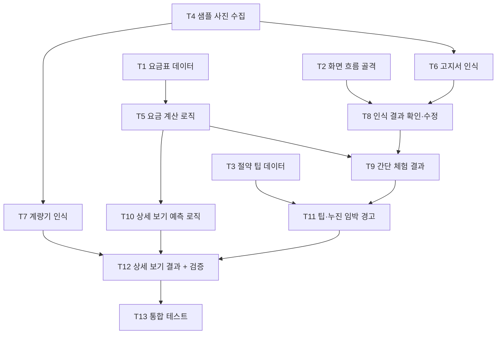

# 5주차 활동지 / Week 5 Worksheet

**1-page 기획서 / One-page plan**

- 작성일 / Date: 26.10.3
- 참여자 / Present: 박현준, 손민석, 이주현, 오지현

## ① 주제 확정 / Confirm topic

- **확정 주제 / Topic:** 누진세 절약 도움 서비스 (자취생용 전기요금 누진 구간 예측·절약 안내, 이번 학기는 전기요금에 집중)
- **이유 / Reason:** 자취생은 누진 구간을 직접 계산하고 관리하기 복잡하고 귀찮아서, 요금이 한 단계 올라간 뒤에야 알게 되는 경우가 많다. 고지서와 계량기를 촬영하기만 하면 현재 누진 구간과 예상 요금을 알려주고, 다음 구간 진입 전에 아낄 수 있는 방법을 안내해 경제적 부담을 줄이고자 한다.

### 핵심 사용 흐름 / Core user flow

1. 서비스 화면 진입
2. 비회원으로 시작 (회원가입은 Could)
3. [전기 요금 시작하기] 버튼 선택
4. 사진 업로드 화면에서 방식 선택
   - **간단 체험:** 고지서만 촬영 → 지난달 사용량으로 누진 구간과 요금을 확인하고 다음 달 관리 방법을 체험
   - **상세 보기:** 계량기 촬영 + 고지서 촬영 → 지난 검침일 이후 실제 사용량으로 이번 달 예상 요금 계산
5. 계산 결과(누진 단계, 요금, 다음 구간까지 남은 사용량)를 간단한 절약 팁과 함께 화면에 표시

> 고지서 사진은 두 방식 모두 필수, 계량기 사진은 상세 보기에서만 사용한다. 고지서 사진이 없으면 [Next] 버튼이 비활성화된다.

---

## ② 태스크 분해와 의존 관계 / Tasks and dependencies

### 태스크 목록 / Task list

| # | 태스크 Task | 완료 조건 Done when | 선행 태스크 Depends on | 담당 Owner |
|---|---|---|---|---|
| T1 | 주택용 전기요금표 데이터 정리 | 기타 계절·하계(7~8월) 각각 1~3단계 구간 기준, 기본요금, kWh당 요금이 JSON 파일 1개로 저장되고 한전 요금표와 값이 일치함 | - | 손민석 |
| T2 | 화면 흐름 골격 제작 | 시작(비회원 진입) → [전기 요금 시작하기] → 사진 업로드 → 결과 화면까지 버튼으로 이동되고, 고지서 사진이 없으면 [Next]가 비활성화됨 | - | 오지현 |
| T3 | 절약 팁 데이터 작성 | 절약 팁 10개 이상이 행동 내용과 예상 절감량(kWh 또는 원)과 함께 JSON 파일로 정리됨 | - | 이주현 |
| T4 | 고지서·계량기 샘플 사진 수집 | 전기 고지서 사진 10장 이상, 계량기 사진 20장 이상과 각 사진의 정답 값을 적은 목록 파일이 저장소에 올라감 (이름·주소·고객번호는 가림) | - | 이주현 |
| T5 | 요금 계산 로직 구현 | 사용량과 월을 넣으면 누진 단계, 예상 요금, 다음 구간까지 남은 kWh를 돌려주는 함수가 테스트 5건(150, 210, 450kWh 기타 계절 / 310kWh 하계 / 0kWh)을 모두 통과함 | T1 | 손민석 |
| T6 | 고지서 사진 인식 (OCR) | 고지서에서 사용량(kWh), 당월 지침, 검침일을 추출하고 T4 고지서 10장 중 8장 이상에서 세 값이 모두 정답과 일치함 | T4 | 박현준 |
| T7 | 계량기 사진 인식 (OCR) | T4 계량기 사진 20장 중 16장 이상(80%)에서 지침 숫자를 정확히 인식함 | T4 | 박현준 |
| T8 | 인식 결과 확인·수정 화면 | 인식한 값이 입력칸에 채워져 표시되고 사용자가 직접 고칠 수 있음. 인식 실패 시 "다시 촬영하거나 직접 입력해 주세요" 안내가 표시됨 | T2, T6 | 오지현 |
| T9 | 간단 체험 결과 화면 | 고지서만 올렸을 때 지난달 사용량 기준 누진 단계, 요금, 다음 구간까지 남은 kWh가 [확인] 후 3초 이내에 표시됨 (예: 210kWh → "누진 2단계") | T5, T8 | 오지현 |
| T10 | 상세 보기 예측 로직 | (계량기 지침 − 고지서 당월 지침)과 검침일 이후 경과일로 이번 달 예상 사용량을 계산하는 함수가 테스트 3건을 통과함 (예: 10일 동안 70kWh 사용 → 한 달 약 210kWh 예상) | T5 | 손민석 |
| T11 | 절약 팁·누진 임박 경고 표시 | 결과 화면에 절약 팁 3개가 예상 절감량과 함께 표시되고, 사용량이 다음 구간 기준의 90% 이상이면 "누진 구간 진입 임박" 경고가 함께 표시됨 | T3, T9 | 이주현 |
| T12 | 상세 보기 결과 화면 + 입력 검증 | 계량기·고지서를 모두 올리면 이번 달 예상 사용량, 누진 단계, 예상 요금이 팁과 함께 표시됨. 계량기 지침이 고지서 당월 지침보다 작으면 계산하지 않고 붉은색 경고 문구가 표시됨 | T7, T10, T11 | 오지현 |
| T13 | 시연 시나리오 통합 테스트 | 간단 체험·상세 보기 흐름과 실패 경로(인식 실패, 지침 역전)를 처음부터 끝까지 3회 연속 오류 없이 실행함 | T12 | 손민석 |

### 의존 관계 그래프 / Dependency graph (DAG)

- **지금 착수 가능 (진입 차수 0) / Can start now (in-degree 0):** T1, T2, T3, T4
- **작업 순서 (위상정렬) / Work order (topological sort):** T1 → T2 → T3 → T4 → T5 → T6 → T7 → T10 → T8 → T9 → T11 → T12 → T13
- **사이클이 있었다면 어떻게 풀었는가 / If there was a cycle, how did you fix it?:** 사이클 없음. 처음에는 "결과 화면"과 "절약 팁 표시"가 서로를 필요로 하는 것처럼 보였지만, 팁 내용(T3 데이터)과 팁을 보여주는 기능(T11)을 따로 나누고, 간단 체험 결과 화면(T9)을 먼저 만든 뒤 팁을 붙이고, 상세 보기(T12)는 완성된 팁 화면을 재사용하도록 순서를 정해 순환이 생기지 않게 했다.

---

## ③ 범위 결정 / Scope

### Must — 없으면 성립 안 됨 / essential

- **핵심 시나리오 / Core scenario:** 비회원으로 들어온 자취생이 [전기 요금 시작하기]를 누르고 고지서만 촬영하면, 지난달 사용량이 자동으로 인식되어 누진 단계, 요금, 다음 구간까지 남은 사용량이 간단한 절약 팁과 함께 화면에 표시된다. (간단 체험 흐름)
  - 해당 태스크: T1, T2, T3, T4(고지서), T5, T6, T8, T9, T11

### Should

- **시나리오 / 상세 보기:** 계량기와 고지서를 함께 촬영하면 지난 검침일 이후 실제 사용량으로 이번 달 예상 사용량과 예상 요금을 계산하고, 계량기 지침이 고지서 지침보다 작으면 경고를 보여준다. (T4(계량기), T7, T10, T12)
- **시나리오 / 절약 팁 제공** : 사용량이 다음 누진 구간 기준의 90%에 도달하면 경고와 함께 예상 절감량이 포함된 절약 팁 3개를 보여준다. 
- **시나리오 / 계량기 사진 인식** : 계량기를 촬영하면 숫자를 자동으로 인식해 입력칸을 채운다. 

### Could

- **시나리오 / 회원가입:** 회원으로 가입하면 지난 계산 결과를 저장해 다음 달에 고지서 없이도 비교할 수 있다.
- **시나리오 / 월마다 평균 사용량 추이:** 회원의 지난 달 사용량을 모아 월별 그래프와 평균 사용량을 보여준다. (회원가입이 먼저 필요)
- **시나리오 / 가스 예상 요금 표시:** 전기 기능이 모두 완성되면, 가스 고지서·계량기를 촬영했을 때 이번 달 예상 가스 요금을 보여준다. 도시가스는 누진제가 없으므로 구간 경고 없이 예상 금액만 표시한다. 12주차에 전기 흐름(T13)이 3회 연속 오류 없이 동작하는지 확인한 뒤 진행 여부를 판단한다.
  - 예상 태스크: 지역 도시가스 요금표 정리 → 가스 요금 계산 함수(㎥→MJ 열량 환산 포함) → 결과 화면에 가스 요금 추가
- **시나리오 / 이용 불가 주거 안내**: 개별 계량기가 없는 주거 유형을 고르면 서비스 이용 불가 안내를 보여준다. 

### Won't — 이번 학기에 안 함 / not this semester

| Won't 항목 Item | 포기한 이유 Why |
|---|---|
| 푸시 알림 발송 | 앱 설치·알림 서버가 필요하고 계량기 값이 자동으로 들어오지 않아 알림 시점을 잡을 수 없음. 결과 화면 안의 경고 표시로 대체 |
| 한전 실시간 사용량 연동 | 사용자 본인의 한전 계정과 실제 개인정보가 필요해 수업 프로젝트 범위를 넘음 |
| 한전 표준 외 고지서 인식 | 아파트 관리비 고지서처럼 전기요금이 다른 항목과 섞인 양식은 형태가 제각각이라 인식 정확도를 보장하기 어려움. 한전 전기요금 고지서만 지원 |
| 주거 유형 선택 단계 | 고지서가 필수라 개별 고지서가 없는 주거 형태(고시원 등)는 자연스럽게 이용할 수 없음. 별도 선택 단계 대신 고지서 인식 실패 안내로 대체 |
| 가스 요금 누진 안내 | 도시가스 요금에는 누진제가 없어 안내할 구간 자체가 없음 (예상 요금 표시는 Could로 검토) |
| 수도 요금 안내 | 대부분 지역에서 가정용 수도요금 누진제가 폐지되어 서비스 목적과 맞지 않고, 지자체마다 요금 체계가 달라 범위를 넘음. 원룸은 관리비 포함이나 세대 수 분할이 많아 개별 계량기 입력도 어려움 |

### 실행 가능성 확인 / Feasibility check

- **특수 장비·유료 API·실제 개인정보가 필요한가? 대안은?**
  - 특수 장비: 필요 없음. 스마트폰 카메라와 노트북만 사용.
  - 유료 API: 사진 인식은 무료 오픈소스 OCR(Tesseract, EasyOCR 등)을 우선 사용하고, 정확도가 부족하면 무료 사용량 안에서 클라우드 OCR을 검토한다. 절약 팁은 미리 작성한 데이터(T3)를 쓰므로 유료 생성형 AI API가 필요 없다.
  - 실제 개인정보: 고지서에는 이름·주소·고객번호가 있으므로 샘플은 해당 부분을 가려서 사용한다. 서비스에서는 사진을 저장하지 않고 필요한 숫자(사용량, 지침, 검침일)만 추출한 뒤 버린다. 요금표는 한전 공개 자료를 사용한다.
- **15주차에 발표장에서 시연할 수 있는 형태인가?**
  - 가능. 웹 앱을 노트북이나 휴대폰 브라우저에서 실행해 시연한다. 발표장에는 실제 계량기가 없으므로 미리 찍어 둔 샘플 고지서·계량기 사진(T4)을 업로드해 간단 체험과 상세 보기 흐름을 보여주고, 인식이 실패하는 경우에 대비해 직접 수정 경로(T8)도 함께 시연한다.

---

## ④ 가장 먼저 동작시킬 흐름 (Walking Skeleton) / First end-to-end flow

**[고지서 사진을 올리면]** → **[사용량(예: 210kWh)을 인식하고 요금표에서 누진 구간과 요금을 구해서]** → **[화면에 "누진 2단계 · 요금 OO,OOO원"이 나온다]**

> 사진 인식이 아직 불안정하면 인식 단계는 임시로 직접 입력으로 대신하고, 업로드 → 계산 → 결과 표시가 먼저 끝까지 이어지게 만든다.
