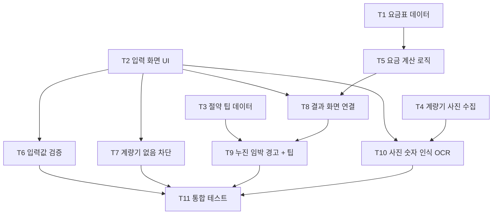

# 5주차 활동지 / Week 5 Worksheet

**1-page 기획서 / One-page plan**

- 작성일 / Date: 26.10.2
- 참여자 / Present: 박현준, 손민석, 이주현, 오지현

---

## ① 주제 확정 / Confirm topic

- **확정 주제 / Topic:** 누진세 절약 도움 서비스 (자취생용 전기요금 누진 구간 예측·절약 안내, 이번 학기는 전기요금에 집중)
- **이유 / Reason:** 자취생은 누진 구간을 직접 계산하고 관리하기 복잡하고 귀찮아서, 요금이 한 단계 올라간 뒤에야 알게 되는 경우가 많다. 계량기 숫자만 넣으면 현재 구간과 예상 요금을 알려주고, 다음 구간 진입 전에 아낄 수 있는 방법을 안내해 경제적 부담을 줄이고자 한다.

---

## ② 태스크 분해와 의존 관계 / Tasks and dependencies

### 태스크 목록 / Task list

| # | 태스크 Task | 완료 조건 Done when | 선행 태스크 Depends on | 담당 Owner |
|---|---|---|---|---|
| T1 | 주택용 전기요금표 데이터 정리 | 기타 계절·하계(7~8월) 각각 1~3단계 구간 기준, 기본요금, kWh당 요금이 JSON 파일 1개로 저장되고 한전 요금표와 값이 일치함 | - | 팀원 A |
| T2 | 입력 화면 UI 제작 | 주거 유형 선택, 전월·당월 계량기 지침 입력칸, [예측하기] 버튼이 화면에 표시되고 버튼 클릭 시 입력값이 콘솔에 출력됨 | - | 팀원 B |
| T3 | 절약 팁 데이터 작성 | 절약 팁 10개 이상이 행동 내용과 예상 절감량(kWh 또는 원)과 함께 JSON 파일로 정리됨 | - | 팀원 D |
| T4 | 계량기 샘플 사진 수집 | 계량기 사진 20장 이상과 각 사진의 정답 숫자를 적은 목록 파일이 저장소에 올라감 (주소·고객번호 등 개인정보는 가림) | - | 팀원 C |
| T5 | 요금 계산 로직 구현 (AC-1) | 사용량과 월을 넣으면 누진 단계와 예상 요금을 돌려주는 함수가 테스트 5건(150, 210, 450kWh 기타 계절 / 310kWh 하계 / 0kWh)을 모두 통과함 | T1 | 팀원 A |
| T6 | 입력값 검증 (AC-3) | 당월 지침이 전월보다 작거나 음수일 때 계산이 진행되지 않고 입력창 아래에 붉은색 경고 문구가 표시됨 | T2 | 팀원 B |
| T7 | 개별 계량기 없음 차단 (AC-4) | 주거 유형에서 '개별 계량기 없음'을 고르면 안내 팝업이 뜨고 입력 화면으로 넘어가지 않음 | T2 | 팀원 D |
| T8 | 결과 화면 연결 (AC-1) | 전월 1000, 당월 1210 입력 후 버튼을 누르면 3초 이내에 "누진 2단계"와 예상 요금(원)이 화면에 표시됨 | T2, T5 | 팀원 B |
| T9 | 누진 임박 경고 + 절약 팁 표시 (AC-2) | 사용량이 다음 구간 기준의 90% 이상(예: 기타 계절 180kWh)이면 결과 화면에 "누진 구간 진입 임박" 경고와 절약 팁 3개가 예상 절감량과 함께 표시됨 | T3, T8 | 팀원 D |
| T10 | 계량기 사진 숫자 인식 (OCR) | T4 사진 20장 중 16장 이상(80%)에서 숫자를 정확히 인식하고, 인식한 값이 당월 지침 입력칸에 자동으로 채워짐. 인식 실패 시 "다시 촬영하거나 직접 입력해 주세요" 안내가 표시됨 | T2, T4 | 팀원 C |
| T11 | 시연 시나리오 통합 테스트 | 사진 업로드 → 인식 → 결과 → 경고·팁 흐름과 실패 경로(AC-3, AC-4)를 처음부터 끝까지 3회 연속 오류 없이 실행함 | T6, T7, T9, T10 | 팀원 A |

### 의존 관계 그래프 / Dependency graph (DAG)

- **지금 착수 가능 (진입 차수 0) / Can start now (in-degree 0):** T1, T2, T3, T4
- **작업 순서 (위상정렬) / Work order (topological sort):** T1 → T2 → T3 → T4 → T5 → T6 → T7 → T10 → T8 → T9 → T11
- **사이클이 있었다면 어떻게 풀었는가 / If there was a cycle, how did you fix it?:** 사이클 없음. 처음에는 "결과 화면"과 "절약 팁 화면"이 서로를 필요로 하는 것처럼 보였지만, 팁 내용(T3 데이터)과 팁을 보여주는 기능(T9)을 따로 나누고 결과 화면(T8)이 먼저 끝나도록 순서를 정해 순환이 생기지 않게 했다.

---

## ③ 범위 결정 / Scope

### Must — 없으면 성립 안 됨 / essential

- **핵심 시나리오 / Core scenario:** 자취생이 전월·당월 계량기 지침을 입력하고 [예측하기]를 누르면, 이번 달 사용량과 현재 누진 단계, 예상 요금이 화면에 표시된다. 잘못된 값을 넣으면 계산 대신 경고가 뜬다.
  - 해당 태스크: T1, T2, T5, T6, T8

### Should

- **시나리오 / 절약 팁 제공:** 사용량이 다음 누진 구간 기준의 90%에 도달하면 경고와 함께 예상 절감량이 포함된 절약 팁 3개를 보여준다. (T3, T9)
- **시나리오 / 계량기 사진 인식:** 계량기를 촬영하면 숫자를 자동으로 인식해 입력칸을 채운다. (T4, T10)
- **시나리오 / 이용 불가 주거 안내:** 개별 계량기가 없는 주거 유형을 고르면 서비스 이용 불가 안내를 보여준다. (T7)

### Could

- **시나리오 / 월마다 평균 사용량 추이:** 지난 달들의 사용량을 저장해 월별 그래프와 평균 사용량을 보여준다.
- **시나리오 / 가스 예상 요금 표시:** 전기 기능이 모두 완성되면, 가스 계량기 지침을 입력했을 때 이번 달 예상 가스 요금을 보여준다. 도시가스는 누진제가 없으므로 구간 경고 없이 예상 금액만 표시한다. 12주차에 전기 흐름(T11)이 3회 연속 오류 없이 동작하는지 확인한 뒤 진행 여부를 판단한다.
  - 예상 태스크: 지역 도시가스 요금표 정리 → 가스 요금 계산 함수(㎥→MJ 열량 환산 포함) → 결과 화면에 가스 요금 추가

### Won't — 이번 학기에 안 함 / not this semester

| Won't 항목 Item | 포기한 이유 Why |
|---|---|
| 푸시 알림 발송 | 앱 설치·알림 서버가 필요하고 계량기 값이 자동으로 들어오지 않아 알림 시점을 잡을 수 없음. 결과 화면 안의 경고 표시로 대체 |
| 한전 실시간 사용량 연동 | 사용자 본인의 한전 계정과 실제 개인정보가 필요해 수업 프로젝트 범위를 넘음 |
| 가스 요금 누진 안내 | 도시가스 요금에는 누진제가 없어 안내할 구간 자체가 없음 (예상 요금 표시는 Could로 검토) |
| 수도 요금 안내 | 대부분 지역에서 가정용 수도요금 누진제가 폐지되어 서비스 목적과 맞지 않고, 지자체마다 요금 체계가 달라 범위를 넘음. 원룸은 관리비 포함이나 세대 수 분할이 많아 개별 계량기 입력도 어려움 |
| 고지서 전체 인식 | 지역·회사마다 고지서 양식이 달라 인식 정확도를 보장하기 어려움. 계량기 숫자 인식에만 집중 |
| 회원가입·로그인 | 핵심 시나리오에 필요 없음. 전월 지침은 사용자가 직접 입력 |

### 실행 가능성 확인 / Feasibility check

- **특수 장비·유료 API·실제 개인정보가 필요한가? 대안은?**
  - 특수 장비: 필요 없음. 스마트폰 카메라와 노트북만 사용.
  - 유료 API: 사진 인식은 무료 오픈소스 OCR(Tesseract, EasyOCR 등)을 우선 사용하고, 정확도가 부족하면 무료 사용량 안에서 클라우드 OCR을 검토한다. 절약 팁은 미리 작성한 데이터(T3)를 쓰므로 유료 생성형 AI API가 필요 없다.
  - 실제 개인정보: 필요 없음. 팀원 본인 집 계량기 사진을 쓰고 주소·고객번호는 가린다. 요금표는 한전 공개 자료를 사용한다.
- **15주차에 발표장에서 시연할 수 있는 형태인가?**
  - 가능. 웹 앱을 노트북이나 휴대폰 브라우저에서 실행해 시연한다. 발표장에서는 실제 계량기가 없으므로 미리 찍어 둔 샘플 사진(T4)을 업로드해 인식 → 결과 → 절약 팁 흐름을 보여주고, 인식이 실패하는 경우에 대비해 직접 입력 경로도 함께 시연한다.

---

## ④ 가장 먼저 동작시킬 흐름 (Walking Skeleton) / First end-to-end flow

**[전월 지침 1000, 당월 지침 1210을 입력하면]** → **[사용량 210kWh를 계산하고 요금표에서 누진 구간과 예상 요금을 구해서]** → **[화면에 "누진 2단계 · 예상 요금 OO,OOO원"이 나온다]**
